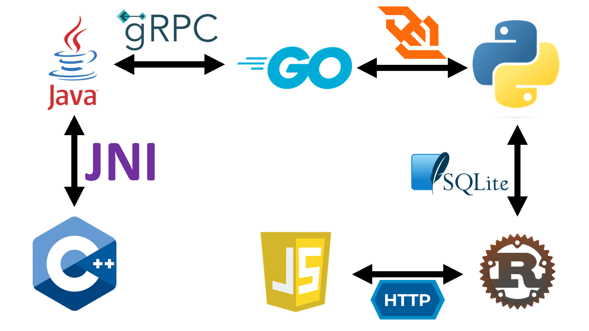
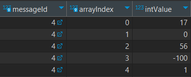

<h1 align="center">Translator</h1>

Who are translators? These are people who help
speakers of different languages communicate.
This project is devoted to a similar procedure.
It shows in what ways programs written in different
programming languages can communicate with each other.

---

<h3 align="center">Communication methods</h3>

As "translators" who will allow our programs to communicate,
We will use the following technologies:

- Standard HTTP requests
- WebSockets
- gRPC
- Sharing SQLite database
- JNI

In addition to communication between applications, these technologies also transfer data,
therefore this process will also be considered. Now a little about each tool:

1. **HTTP requests.** This is a way of interaction between a client and a server through a protocol
   HTTP. A request-response model is used, where the client sends a request to the server,
   and the server returns the response. This is the most common way of interaction between two
   applications;

2. **WebSockets.** This is a protocol for establishing a persistent two-way connection
   between client and server over a single TCP connection. Unlike HTTP, which
   uses a request-response model, WebSockets allow both parties to communicate
   real-time data without the need to reopen the connection;

3. **gRPC.** This is a modern RPC (Remote Procedure Call) framework developed by Google,
   which uses Protocol Buffers for data serialization and HTTP/2 for transmission
   data;

4. **Database sharing.** This method involves using the same
   databases with several programs for data exchange. Since the entire project will
   deploy on one host, for example it will be enough to use the SQLite DBMS,
   which stores all information in one file with the extension `.db`. In comparison, there will be
   considered the general case of using databases, which, as a rule,
   support network access and simultaneous reading of data by several users;

5. **JNI (Java Native Interface).** This is a programming interface that allows
   Java code interacts with native libraries written in C or C++.
   This method can be used to improve performance or access
   low-level system resources.

<h3 align="center">Comparison of interaction methods</h3>

For a more detailed comparison of data transfer methods between applications,
Let's look at several of their criteria:
- support for programming languages;
- data types;
- ability to work over the network;
- security during data transmission.

First, let's look at the first 2 characteristics:

<table>
    <thead>
        <tr>
            <th>Method</th>
            <th>Supported languages</th>
            <th>Data types</th>
        </tr>
    </thead>
    <tbody>
        <tr>
            <td>HTTP requests</td>
            <td>All modern languages</td>
            <td>JSON, XML, HTML etc.</td>
        </tr>
        <tr>
            <td>WebSockets</td>
            <td>All modern languages</td>
            <td>Text, binary data</td>
        </tr>
        <tr>
            <td>gRPC</td>
            <td>C#, C++, Dart, Go, Java, Kotlin, Node.js,
                Objective-C, PHP, Python, and Ruby</td>
            <td>Protocol Buffers</td>
        </tr>
        <tr>
            <td>Sharing database</td>
            <td>All modern languages</td>
            <td>Depends on the selected DBMS</td>
        </tr>
        <tr>
            <td>JNI</td>
            <td>Only from Java you can call functions in C/C++</td>
            <td>Primitives, structures</td>
        </tr>
    </tbody>
</table>

As you can see, in the case of some languages,
the choice becomes narrower. In general, this is
not a problem. JNI is still a feature and advantage
of Java, and all the most convenient methods are
available for all modern programming languages.
When it comes to data types, everyone is used to
strings, integers, floats, etc. In HTTP, these
types are supported by the JSON format, but are
still converted to strings for transmission, which
increases the size of messages. For Websockets,
you need to use the same serializers and
deserializers and transfer data in binary form.
Protobuf, JNI and all popular DBMSs also support
the primitives we are familiar with.

For a general understanding, let's look at networking
capabilities and data transmission protection.

<table>
    <thead>
        <tr>
            <th>Method</th>
            <th>Networking</th>
            <th>Security</th>
        </tr>
    </thead>
    <tbody>
        <tr>
            <td>HTTP requests</td>
            <td>Present</td>
            <td>TLS/SSL</td>
        </tr>
        <tr>
            <td>WebSockets</td>
            <td>Present</td>
            <td>TLS/SSL</td>
        </tr>
        <tr>
            <td>gRPC</td>
            <td>Present</td>
            <td>TLS/SSL</td>
        </tr>
        <tr>
            <td>Sharing database</td>
            <td>Present in almost all DBMSs</td>
            <td>TLS/SSL + authorization system of the DBMS itself</td>
        </tr>
        <tr>
            <td>JNI</td>
            <td>Absent</td>
            <td>Not required as it works locally</td>
        </tr>
    </tbody>
</table>

JNI stands out from the rest, but again, it serves as a feature of the Java
language, and not used for remote connection. Otherwise, everything is clear here.

<h3 align="center">Languages</h3>

As languages used to write programs that we will be "friends" with
among themselves, `Java`, `C++`, `Rust`, `JavaScript`, `Python` and `Go` were selected. On
The picture shows exactly how they will be connected.

<h5 align="right">Communication scheme</h5>



<h3 align="center">Architecture</h3>

How will this all work? We will pass 2 parameters in all five ways: an array
of integers and some string. To do this, at one end there will be a web page
with JavaScript code that will transfer the data entered on the page
(array and string) via HTTP to the local host, where the Rust web server will
run. It, in turn, like all other applications, will do one simple operation
with this data - cyclically shift the array and string to the right by 1
element and pass them on. At the other end, the C++ code will concatenate
this data into one string and pass it back. As a result, the resulting string
as a result of repeated transformations will be displayed on the original web
page. All this is just a test example of information processing; the main thing
for us is to get all applications to communicate with each other.

<h3 align="center">JavaScript</h3>

Let's start with a web page that accepts input and passes it on. Let's determine
in advance that the Rust web server will run on port `8101`. This is due to the
fact that ports consecutively from `8101` to `8106` are free by default. You can
check this [here](https://en.wikipedia.org/wiki/List_of_TCP_and_UDP_port_numbers).
I chose these ports for convenience, although not all of our applications will need
them. The port number on which the Rust server will run is needed to specify the
address in the request parameter in the JavaScript function. In total, we need:
[HTML](JavaScript/index.html) code for creating input elements on the page,
[CSS](JavaScript/style.css) code for styling these elements and
[JavaScript](JavaScript/script.js) -code for converting and sending data, as well
as for the operation of buttons.

Everything is simple here. JavaScript uses the `fetch()` method to send data over
HTTP. When a form is submitted, the `submit` event is intercepted using
`event.preventDefault()` to prevent the form from defaulting. The data from the
text field and the number array is then collected to form a `data` object, which
is converted to JSON format using `JSON.stringify()`. The request is sent using
the POST method to the local host on port `8101` with a
`Content-Type: application/json` header to indicate the type of data being sent.
The server response is processed using promises (`then` and `catch`) to handle
successful response or errors. Below is the appearance of the form.

<h5 align="right">Input form</h5>
<div align="center">
    
</div>

Sent data in JSON format:
```json
{
  "text": "input_string",
  "array": [
    0,
    56,
    -100,
    1,
    17
  ]
}
```

<h3 align="center">SQLite</h3>
<h5 align="right">Theory</h5>

Before you start writing a Rust server, you need to design a mechanism for
transferring information through the database. In it, we will have at least 2
entities: a message containing a string and an array, and a message containing
only a string. Since arrays are not supported natively in SQL, and casting an
array to a string and storing it in this form violates first normal form,
we Let's create a third entity - an array element. Each element will have
an association with a specific message, as well as an index in the array to
maintain order. After sending messages, all their data will be deleted, so
there is no point in creating indexes in the database. All SQL scripts will be
stored in a separate [file](SQL/create.sql).

Code to create all necessary tables:
```sql
CREATE TABLE IF NOT EXISTS InputMessages (
    id INTEGER PRIMARY KEY AUTOINCREMENT,
    string TEXT NOT NULL,
    arraySize INTEGER NOT NULL
);

CREATE TABLE IF NOT EXISTS ArrayElements (
    messageId INTEGER NOT NULL,
    arrayIndex INTEGER NOT NULL,
    intValue INTEGER NOT NULL,
    PRIMARY KEY (messageId, arrayIndex),
    FOREIGN KEY (messageId) REFERENCES InputMessages(id)
);

CREATE TABLE IF NOT EXISTS OutputMessages (
    id INTEGER PRIMARY KEY,
    string TEXT NOT NULL
);
```

All attributes are marked as `NOT NULL`. Primary and foreign keys are created
more for appearance, since the database will rarely store more than one message.

Now that we have theoretically created a database, we can figure out how messages
will be transmitted through it. The Python server will continuously, after a
certain period of time, check for incoming messages in the database. At the
moment when data comes from a Web page to Rust, it will transform it and send
it to the database using a transaction, since it needs to ensure that if Python
sees the data, it will see it in its entirety.

Code for inserting data:

```sql
BEGIN TRANSACTION;

INSERT INTO InputMessages (string, arraySize)
VALUES ('ginput_strin', 5);

SELECT last_insert_rowid();

INSERT INTO ArrayElements (messageId, arrayIndex, intValue) VALUES
    (<id>, 0, 17),
    (<id>, 1, 0),
    (<id>, 2, 56),
    (<id>, 3, -100),
    (<id>, 4, 1);
    
COMMIT;
```

This uses the SQLite built-in function `last_insert_rowid()`,
which returns the ID of the last row of data inserted. Once
Rust knows the id value of the send message, it can fill in
the array elements by substituting the known value for `<id>`.
By executing the `COMMIT` command, we apply all the changes
made after the `BEGIN TRANSACTION` command. The Python server
will run a command asking for the id of the first message:

```sql
SELECT id
FROM InputMessages
LIMIT 1;
```

If the message is not found, after some time the request will
be sent again, and so on. Otherwise, another transaction will
be executed, in which the value of the found message id will
be substituted for <id>:

```sql
BEGIN TRANSACTION;

SELECT string, arraySize
FROM InputMessages
WHERE id = <id>;

SELECT arrayIndex, intValue
FROM ArrayElements
WHERE messageId = <id>;

DELETE FROM ArrayElements
WHERE messageId = <id>;

DELETE FROM InputMessages
WHERE id = <id>;

COMMIT;
```

This transaction also deletes all requested data.
The Rust application, after sending data to the database,
begins to wait for a response in the `OutputMessages` table,
executing a similar request:

```sql
SELECT string
FROM OutputMessages
WHERE id = <id>;
```

The id value of the response message is the same as the id value
of the send message. If the message is found, the `string` field
will be returned to the web page. Now, let's actually create a
database file.

<h5 align="right">Practice</h5>

In order to interact with SQLite directly or through Rust,
you need to download the `dll` and `tools` archives from
their [site](https://www.sqlite.org/download.html). Find
the item `Precompiled Binaries for Windows` and select the
ones you need, according to the bit depth of your system.
Extract the contents of both archives into one directory,
for example `C:\sqlite`. Now, you need to add the path to
this directory to the environment variables: `PATH` and `LIB`.
To create a database, go to the directory with the repository
and enter the command: `sqlite3 SQL/messages.db < SQL/create.sql`.
SQLite will create a database file called `messages` in the SQL
directory and apply the SQL code contained in the create.sql file
to it, creating 3 tables.

That's it, the database is now ready to go!

<h3 align="center">Rust</h3>

Now, using Rust, you need to create a Web server running on
port `8101`. I will use the `actix-web` libraries to work with
queries and `rusqlite` to work with the database. We create a
project while in the repository directory using the
`cargo new Rust` command. In [file](Rust/Cargo.toml)
`Cargo.toml` add the dependencies of the mentioned libraries:
```toml
[dependencies]
actix-web = "4"
rusqlite = { version = "0.29.0", features = ["bundled"] }
serde = { version = "1.0", features = ["derive"] }
serde_json = "1.0"
actix-cors = "0.6"
tokio = { version = "1", features = ["full"] }
```

There are also libraries for working with the JSON format,
delaying thread execution, and for setting up CORS. All
server code is contained in [file](Rust/src/main.rs) `.rs`.
To shift a string and an array, the `cyclic_shift_string`
and `cyclic_shift_array` functions are used, the request
is accepted along the root route and will return the result
as a string requested from the database. But, until the
application is implemented in python, the wait for a response
will be eternal. But we can already see the filled data in
the database:

<div align="center">
    
    
</div>  

The program shifted them cyclically to the right, which is
why the last letter became the first, and the last element
of the array became the first. The path to the database will
be passed as an argument to startup. The finished project
needs to be compiled into an executable file:
```shell
cargo build --release
```
It will be located in `Rust/target/release`. Now, it's time
to start implementing the Python part.

<h3 align="center">Python</h3>
To interact with web sockets, you need to install the
websockets library: `pip install websockets`. Other libraries
(for example, for interacting with the database) are included
in the standard library. All code is in one [file](Python/main.py)
with a `.py` extension.

The program works like this: it checks whether there are messages
in the database, and if there are, it sends a message via a web
socket to a server running locally on port `8102`. After sending,
a string message is expected, which is placed in the database after
receiving. The path to the database will be passed as an argument
at startup, just like in Rust.

<h3 align="center">gRPC & Protocol Buffers</h3>

To exchange or transfer data via a Remote Procedure Call (RPC), you must
use the "Protocol Buffers" - a protocol for transferring, serializing and
deserializing data. For this, all functions and messages are described in
a special file with the extension `.proto`. Recall that we need to pass a
string and an array of integers, but return only the string. To study the
available data types and their analogues in programming languages, you can
read the
[documentation](https://protobuf.dev/programming-guides/proto3/#scalar).
We will define 2 message types: request (`DataRequest`) and response
(`DataResponse`). In the `.proto` file it would look like this:
```protobuf
syntax = "proto3";

package translator;

option go_package = "protobuf/translator;service";
option java_multiple_files = true;
option java_package = "com.prohor.grpc";
option java_outer_classname = "TranslatorOuterClass";

service TranslatorService {
  rpc Process (DataRequest) returns (DataResponse);
}

message DataRequest {
  string text = 1;
  repeated int32 array = 2;
}

message DataResponse {
  string response = 1;
}
```
Let me explain the remaining fields. `syntax` indicates the version
of the protobuf format to use. `option` specifies language-specific
options. Since we are using Go and Java, we set the values for the
necessary parameters. By their name it is generally clear what they
mean. `Service` is a wrapper for the functions that will be used.
We have only 1 function - `Process`, which receives and returns
messages, with the data types we set.

Now you need to install the protoc compiler. To do this, go to
[their repository releases](https://github.com/protocolbuffers/protobuf/releases/tag/v27.0),
and download the file for your platform. For 64-bit Windows this will
be the file `protoc-27.0-win64.zip`. Unzip the contents somewhere,
for example in `C:\Program Files\Protobuf`, and add the `bin`
folder to PATH. We will use it to generate code in the section
with specific languages.

<h3 align="center">Go</h3>

Now let's create an application in Go. In the repository directory we write:
```shell
md Golang
cd Golang
go mod init Golang
go get github.com/gorilla/websocket
go get google.golang.org/grpc
go get google.golang.org/protobuf/cmd/protoc-gen-go
go get google.golang.org/protobuf/cmd/protoc-gen-go-grpc

go install google.golang.org/protobuf/cmd/protoc-gen-go@latest
go install google.golang.org/grpc/cmd/protoc-gen-go-grpc@latest
```

For these commands to work, Go must be installed. The commands
themselves install the necessary packages for Websockets and
gRPC, as well as plugins for generating code from `.proto` files.
Now go to the directory where our `.proto`
[file](Protobuf/service.proto) is located and write:
```shell
protoc --go_out=../Golang --go-grpc_out=../Golang service.proto
```

This command will generate the necessary files, and place them
according to the `go_package` option. Code files generated with
Protobuf will not be put into the repository due to excessive size.
Now we write the code in the main file [server.go](Golang/server.go).
It runs a Web-Socket server on port `8102` and connects to a gRPC
server running on port `8103`. Let’s immediately assemble the project
into an executable file:
```shell
# Go to the directory with the project
cd ../Golang
# Build the project
go build -o "Golang.exe" server.go
```

<h3 align="center">Java</h3>

The penultimate program will also require code generation using Protobuf.
This will be done by the maven build system plugin that we will use.
Please note the plugins and dependencies I added in the
[pom.xml](Java/pom.xml) file. I copied the `.proto` file into the
`src/main/proto` directory so that the plugin would detect it. When
we run the `package` task from the `Lifecycle` item of the project in
maven, the necessary code will be generated, and we will be able to use it.
The `Main` class will start the server on port `8103`. The
`TranslatorService` class will be inherited from the generated service
class, which also contains a native function:
```java
class TranslatorService {
    public native String nativeFunction(String text, int[] array);
}
```

As we can see, the function has no implementation - only a
signature. We will implement this function in C++.

<h3 align="center">C++</h3>

To implement a native function, we need to get the signature of this
function for the `.cpp` file, as well as the header file. This is done
using the java compiler `javac`. Let's create a new directory in the
repository directory and go to it:
```shell
md "C++"
cd "C++"
```
Now let's generate a header file, specifying the path to the class
containing the native function:
```shell
javac -h . ../Java/src/main/java/com/prohor/translator/TranslatorService.java
```

We get the [header file](C++/com_prohor_translator_TranslatorService.h),
and, according to the signature of the function from it, we implement it
in the file [main.cpp](C++/main.cpp). Now we need to assemble this code
into a dynamic library. For this we need gcc. For Windows
[download](https://github.com/niXman/mingw-builds-binaries/releases) MINGW.
For the 64-bit version of the OS,
`x86_64-13.2.0-release-posix-seh-msvcrt-rt_v11-rev0.7z` will suit us.
Unzip the contents somewhere, for example in `C:\Program Files\mingw64`,
and also add the `bin` folder to PATH. Now we can create a `.dll` file
from our C++ code. We will need the jdk path for this, so find it out
in advance. Go to the /C++/ directory and write:
```shell
g++ -m64 -c -I"C:\Program Files\Java\jdk-21\include" -I"C:\Program Files\Java\jdk-21\include\win32" main.cpp -o main.o
g++ -m64 -shared -o nativeLib.dll main.o -Wl,--add-stdcall-alias
```
The first command will create the object module `main.o`,
the second will create a dynamic library from this module.
We now have the file `nativeLib.dll`. Now you need to add a
couple of lines to the Java code:
```java
class TranslatorService {
    static {
        System.loadLibrary("nativeLib");
    }
}
```

We specify only the name, since we will specify the path with the
`-Djava.library.path=""` argument when running the program. Now we
can compile the Java project into a JVM executable `.jar` file. To
do this, we run 2 maven tasks: first `clean`, then `install`. A
`.jar` file will appear in the `target` directory.

<h3 align="center">Launch</h3>
We have written all the code, connected all the applications,
all that remains is to launch it all:
```shell
# Go to the repository directory
cd Translator
# Start the Java gRPC server
java -Djava.library.path="C++/" -jar "Java/target/Java-1.0.jar"
# Start the Golang WebSocket server
"Golang/Golang.exe"
# Run the program in Python
py Python/main.py "SQL/messages.db"
# Start the Rust web server
"Rust/target/release/Translator.exe" -- "SQL/messages.db"
# Open a web page
"JavaScript/index.html"
```
Now let's test. Enter the string and array elements. They
should cycle to the right 5 times (in Rust, Python, Go, Java
and C++) and return as a single string.

<h5 align="right">Result on web page</h5>
<div align="center">
    
</div>
Everything is working! But for real projects it is better to choose
a specific method depending on your needs.

<h5 align="right">Prokhorov Timofey</h5>