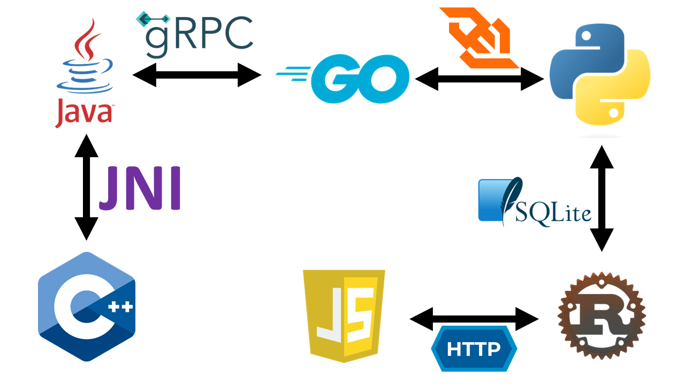
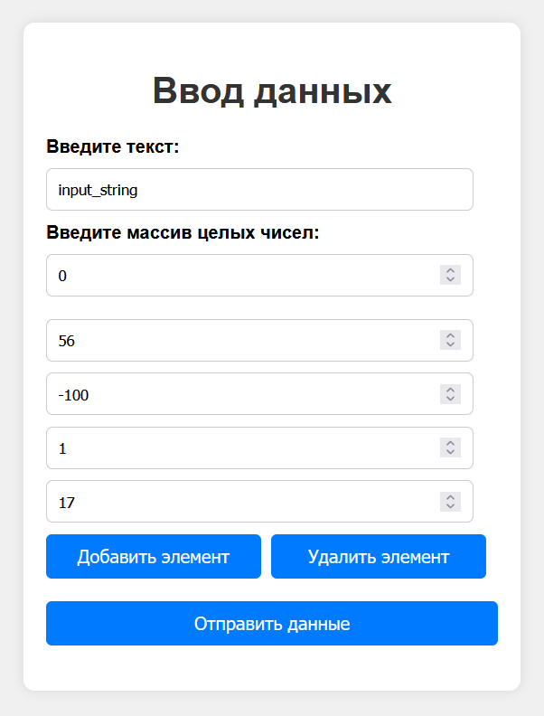
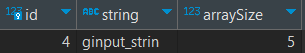
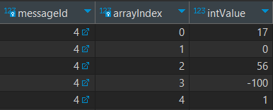

<h1 align="center">Переводчик</h1>

Кто такие переводчики? Это люди, помогающие общаться носителям разных языков.
Данный проект посвящен похожей процедуре - он показывает, какими способами
могут общаться между собой программы, написанные на разных языках программирования.

---

<h3 align="center">Способы взаимодействия</h3>

В качестве "переводчиков", которые позволят общаться нашим программам,
мы будем использовать следующие технологии:

- Стандартные HTTP запросы
- WebSockets
- gRPC
- Общий доступ к базе данных SQLite
- JNI

Помимо общения между приложениями, эти технологии также производят передачу данных,
поэтому этот процесс будет также рассмотрен. Теперь немного про каждое средство:

1. **HTTP запросы.** Это способ взаимодействия между клиентом и сервером через протокол
HTTP. Используется модель запрос-ответ, где клиент отправляет запрос на сервер,
а сервер возвращает ответ. Это самый распространенный способ взаимодействия двух
приложений;
2. **WebSockets.** Это протокол для установления постоянного двустороннего соединения
между клиентом и сервером поверх одного TCP-соединения. В отличие от HTTP, который
использует модель запрос-ответ, WebSockets позволяют обеим сторонам обмениваться
данными в реальном времени без необходимости повторного открытия соединения;
3. **gRPC.** Это современный RPC (Remote Procedure Call) фреймворк, разработанный Google,
который использует Protocol Buffers для сериализации данных и HTTP/2 для передачи
данных;
4. **Общий доступ к базе данных.** Этот способ предполагает использование одной и той же
базы данных несколькими программами для обмена данными. Так как весь проект будет
развернут на одном хосте, для примера достаточно будет использования СУБД SQLite,
которая хранит всю информацию в одном файле с расширением `.db`. В сравнении будет
рассматриваться общий случай использования баз данных, которые, как правило,
поддерживают доступ по сети и одновременное чтение данных несколькими пользователями;
5. **JNI (Java Native Interface).** Это интерфейс программирования, который позволяет
Java коду взаимодействовать с нативными библиотеками, написанными на C или C++.
Этот способ может использоваться для улучшения производительности или доступа к
низкоуровневым системным ресурсам.

<h3 align="center">Сравнение способов взаимодействия</h3>

Для более подробного сравнения способов передачи данных между приложениями,
рассмотрим у них несколько критериев:
- поддержка языков программирования;
- типы данных;
- возможность работы по сети;
- безопасность при передаче данных.

Сначала рассмотрим первые 2 характеристики:

<table>
    <thead>
        <tr>
            <th>Способ взаимодействия</th>
            <th>Поддерживаемые языки</th>
            <th>Типы данных</th>
        </tr>
    </thead>
    <tbody>
        <tr>
            <td>HTTP запросы</td>
            <td>Все современные языки</td>
            <td>JSON, XML, HTML и т.д.</td>
        </tr>
        <tr>
            <td>WebSockets</td>
            <td>Все современные языки</td>
            <td>Текст, бинарные данные</td>
        </tr>
        <tr>
            <td>gRPC</td>
            <td>C#, C++, Dart, Go, Java, Kotlin, Node.js,
                Objective-C, PHP, Python, и Ruby</td>
            <td>Protocol Buffers</td>
        </tr>
        <tr>
            <td>Общий доступ к БД</td>
            <td>Все современные языки</td>
            <td>Зависит от выбранной СУБД</td>
        </tr>
        <tr>
            <td>JNI</td>
            <td>Только из Java можно вызывать функции на C/C++</td>
            <td>Примитивы, структуры</td>
        </tr>
    </tbody>
</table>

Как можно заметить, в случае с некоторыми языками, выбор становится более узким.
В целом, это не проблема. JNI все-таки является особенностью и преимуществом Java,
а все самые удобные методы доступны для всех современных языков программирования.
Что касается типов данных, все привыкли к строкам, целым числам, числам с плавающей
точкой и т.д. В HTTP эти типы поддерживаются форматом JSON, но все равно преобразуются
в строки для передачи, что увеличивает размер сообщений. Для Веб-сокетов нужно
использовать одинаковые сериализаторы и десериализаторы и передавать данные в двоичном
виде. Protobuf, JNI и все популярные СУБД также поддерживают привычные нам примитивы.

Для общего понимания, рассмотрим возможности работы по сети и защиту передачи данных.

<table>
    <thead>
        <tr>
            <th>Способ взаимодействия</th>
            <th>Работа по сети</th>
            <th>Безопасность</th>
        </tr>
    </thead>
    <tbody>
        <tr>
            <td>HTTP запросы</td>
            <td>Есть</td>
            <td>TLS/SSL</td>
        </tr>
        <tr>
            <td>WebSockets</td>
            <td>Есть</td>
            <td>TLS/SSL</td>
        </tr>
        <tr>
            <td>gRPC</td>
            <td>Есть</td>
            <td>TLS/SSL</td>
        </tr>
        <tr>
            <td>Общий доступ к БД</td>
            <td>Есть почти у всех СУБД</td>
            <td>TLS/SSL + система авторизации самой СУБД</td>
        </tr>
        <tr>
            <td>JNI</td>
            <td>Отсутствует</td>
            <td>Не требуется, так как работает локально</td>
        </tr>
    </tbody>
</table>

JNI выделяется среди остальных, но, опять же, он служит как фишка языка Java, и
не используется для удаленного соединения. В остальном тут все понятно.

<h3 align="center">Используемые языки</h3>

В качестве языков, используемых для написания программ, которые мы будем "дружить"
между собой, были выбраны `Java`, `C++`, `Rust`, `JavaScript`, `Python` и `Go`. На
картинке показано, каким именно образом они будут связаны.

<h5 align="right">Схема коммуникации</h5>



<h3 align="center">Архитектура</h3>

Как вообще это все будет работать. Мы будем передавать 2
параметра всеми пятью способами: массив целых чисел и
какую-нибудь строку. Для этого, на одном конце будет
веб-страница с JavaScript кодом, который будет передавать
введенные на странице данные (массив и строку) по HTTP на
локальный хост, где будет работать веб-сервер на Rust.
Он, в свою очередь, как и все остальные приложения, будет делать
одну простую операцию с этими данными - сдвигать циклично массив
и строку вправо на 1 элемент и передавать их дальше. На другом
конце, код на C++ будет объединять эти данные в одну строку и
передавать их обратно. В итоге на первоначальной веб-странице
отобразится получившаяся в результате многократных преобразования
строка. Все это просто тестовый пример обработки информации,
для нас главное - заставить все приложения общаться между
собой.

<h3 align="center">JavaScript</h3>

Начнем с веб-страницы, принимающей входные данные и передающей их дальше. Заранее
определим, что веб-сервер на Rust будет работать на порту `8101`. Это обусловлено тем,
что порты, идущие подряд с `8101` по `8106`, свободны по умолчанию. Это можно проверить
[здесь](https://ru.m.wikipedia.org/wiki/Список_портов_TCP_и_UDP). Я выбрал эти порты
для удобства, хотя не всем нашим приложениям они понадобятся. 
Номер порта, на котором будет работать сервер Rust, нужен
для указания адреса в параметре запроса в функции на JavaScript. Итого нам потребуется:
[HTML](JavaScript/index.html)-код для создания элементов ввода на странице,
[CSS](JavaScript/style.css)-код для стилизации этих элементов и
[JavaScript](JavaScript/script.js)-код для преобразования и отправки данных, а также
для функционирования кнопок.

Тут все просто. В JavaScript для отправки данных по HTTP
используется метод `fetch()`. При отправке формы происходит перехват события `submit`
с помощью `event.preventDefault()`, чтобы предотвратить стандартное поведение формы.
Затем собираются данные из текстового поля и массива чисел, формируя объект `data`,
который конвертируется в JSON-формат с помощью `JSON.stringify()`. Запрос отправляется
методом POST на локальный хост с портом `8101` с заголовком
`Content-Type: application/json` для указания типа отправляемых данных.
Ответ сервера обрабатывается с использованием промисов (`then` и `catch`) для обработки
успешного ответа или ошибок. Ниже показан внешний вид формы.

<h5 align="right">Форма ввода данных</h5>
<div align="center">
    
</div>

Отправленные данные в формате JSON:
```json
{
  "text": "input_string",
  "array": [
    0,
    56,
    -100,
    1,
    17
  ]
}
```

<h3 align="center">SQLite</h3>
<h5 align="right">Теория</h5>
Перед тем, как начинать писать Rust-сервер, необходимо спроектировать механизм передачи
информации через базу данных. В ней у нас будет как минимум 2 сущности: сообщение,
содержащее строку и массив, и сообщение, содержащее только строку. Так как массивы не
поддерживаются в SQL нативно, а приведение массива к строке и хранение в таком виде
нарушает первую нормальную форму (про это можно почитать
[здесь](https://habr.com/ru/articles/254773/)), мы создадим третью сущность -
элемент массива. Каждый элемент будет иметь связь с конкретным сообщением, а также
индекс в массиве, для сохранения порядка. После передачи сообщений, все их данные будут
удаляться, поэтому создавать индексы в базе данных нет смысла. Все SQL-скрипты будут
лежать в отдельном [файле](SQL/create.sql).

Код для создания всех необходимых таблиц:
```sql
CREATE TABLE IF NOT EXISTS InputMessages (
    id INTEGER PRIMARY KEY AUTOINCREMENT,
    string TEXT NOT NULL,
    arraySize INTEGER NOT NULL
);

CREATE TABLE IF NOT EXISTS ArrayElements (
    messageId INTEGER NOT NULL,
    arrayIndex INTEGER NOT NULL,
    intValue INTEGER NOT NULL,
    PRIMARY KEY (messageId, arrayIndex),
    FOREIGN KEY (messageId) REFERENCES InputMessages(id)
);

CREATE TABLE IF NOT EXISTS OutputMessages (
    id INTEGER PRIMARY KEY,
    string TEXT NOT NULL
);
```

Все атрибуты помечены как `NOT NULL`. Первичные и внешние ключи
созданы больше для вида, так как в базе данных редко будет
храниться больше одного сообщения.

Теперь, когда база данных у нас теоретически создана, можем
разобраться, как сообщения будут передаваться через нее.
Сервер на Python будет непрерывно, через определенный промежуток
времени, проверять наличие входящий сообщений в БД. В момент,
когда с Веб-страницы будут приходить данные на Rust, он будет
их преобразовывать и отправлять в БД с помощью транзакции,
так как нужно гарантировать, что если Python и увидит данные,
он увидит их целиком.

Код для вставки данных:

```sql
BEGIN TRANSACTION;

INSERT INTO InputMessages (string, arraySize)
VALUES ('ginput_strin', 5);

SELECT last_insert_rowid();

INSERT INTO ArrayElements (messageId, arrayIndex, intValue) VALUES
    (<id>, 0, 17),
    (<id>, 1, 0),
    (<id>, 2, 56),
    (<id>, 3, -100),
    (<id>, 4, 1);
    
COMMIT;
```

Здесь используется встроенная в SQLite функция
`last_insert_rowid()`, которая возвращает идентификатор
последнего вставленного ряда данных. После того как Rust
узнает значение id отправленного сообщения, можно будет
заполнить данные об элементах массива, подставляя
известное значение вместо `<id>`. Выполняя команду `COMMIT`,
мы как бы применяем все изменения, внесенные после команды
`BEGIN TRANSACTION`. Python сервер будет выполнять команду,
запрашивающую id первого сообщения:

```sql
SELECT id
FROM InputMessages
LIMIT 1;
```

Если сообщение не будет найдено, через некоторое время
запрос будет отправлен повторно и так далее. Иначе, будет
выполнена другая транзакция, в которой вместо <id> будет
подставлено значение найденного id сообщения:

```sql
BEGIN TRANSACTION;

SELECT string, arraySize
FROM InputMessages
WHERE id = <id>;

SELECT arrayIndex, intValue
FROM ArrayElements
WHERE messageId = <id>;

DELETE FROM ArrayElements
WHERE messageId = <id>;

DELETE FROM InputMessages
WHERE id = <id>;

COMMIT;
```

Эта транзакция также удаляет все запрошенные данные.
Приложение на Rust, после отправки данных в БД, начинает ожидать
ответ в таблице `OutputMessages`, выполняя похожий запрос:

```sql
SELECT string
FROM OutputMessages
WHERE id = <id>;
```

Значение id ответного сообщения совпадает со значением id
отправленного сообщения. Если сообщение будет найдено, поле
`string` будет возвращено на веб-страницу. Теперь, давайте на
практике создадим файл с базой данных.

<h5 align="right">Практика</h5>

Для того чтобы взаимодействовать с SQLite напрямую или через
Rust, необходимо скачать `dll` и `tools` архивы с их
[сайта](https://www.sqlite.org/download.html). Находим пункт
`Precompiled Binaries for Windows` и выбираем нужные, согласно
разрядности вашей системы. Извлекаем содержимое обоих архивов
в одну директорию, например в `C:\sqlite`. Теперь, необходимо
добавить путь к этой директории в переменные среды: `PATH` и
`LIB`. Для создания базы данных, переходим в каталог с
репозиторием, и вводим команду:
`sqlite3 SQL/messages.db < SQL/create.sql`. SQLite создаст
файл базы данных с названием `messages` в каталоге SQL
и применит к нему код SQL, содержащийся в файле create.sql и
создающий 3 таблицы.

Все, теперь база данных готова к работе!

<h3 align="center">Rust</h3>
Теперь, с помощью Rust, необходимо создать Веб-сервер, работающий
на порту `8101`. Я буду использовать библиотеки `actix-web` для
работы с запросами и `rusqlite` для работы с БД. Создаем
проект, находясь в каталоге репозитория, используя команду
`cargo new Rust`. В [файл](Rust/Cargo.toml) `Cargo.toml`
добавляем зависимости упомянутых библиотек:
```toml
[dependencies]
actix-web = "4"
rusqlite = { version = "0.29.0", features = ["bundled"] }
serde = { version = "1.0", features = ["derive"] }
serde_json = "1.0"
actix-cors = "0.6"
tokio = { version = "1", features = ["full"] }
```

Тут также присутствуют библиотеки для работы с форматом JSON,
задержки выполнения потока и для настройки CORS. Весь код
сервера содержится в [файле](Rust/src/main.rs) `.rs`. Для сдвига
строки и массива используются функции `cyclic_shift_string` и
`cyclic_shift_array`, запрос принимается по корневому маршруту
и будет возвращать результат в виде строки, напрошенной из
базы данных. Но, пока не реализовано приложение на python,
ожидание ответа будет вечным. Зато, мы уже можем увидеть
заполненные данные в БД:

<div align="center">
    
    
</div>  

Программа сдвинула их циклично вправо, из-за чего последняя буква
стала первой, а последний элемент массива - первым. Теперь, пора
приступить к реализации части на Python.

<h3 align="center">Python</h3>
Для взаимодействия с web-сокетами, необходимо установить
библиотеку websockets: `pip install websockets`.
Остальные библиотеки (например, для взаимодействия с БД)
включены в стандартную библиотеку. Весь код находится в одном
[файле](Python/main.py) с расширением `.py`.

Работает программа так: проверяет, есть ли сообщения в БД,
если есть - отправляет сообщение по web-сокету на сервер,
работающий локально на порту `8102`. После отправки, ожидается
строковое сообщение, которое кладется в базу данных после
получения.

<h3 align="center">gRPC & Protocol Buffers</h3>

Чтобы обмениваться или передавать данные через удаленный вызов процедур
(Remote Procedure Call - RPC), необходимо воспользоваться
"Protocol Buffers" - протоколом передачи, сериализации и
десериализации данных. Для этого, все функции и сообщения описываются
в специальном файле с расширением `.proto`. Вспомним, что нам нужно
передать строку и массив целых чисел, а вернуть только строку. Для
изучения доступных типов данных и их аналогов в языках программирования,
можно ознакомиться с
[документацией](https://protobuf.dev/programming-guides/proto3/#scalar).
Мы определим 2 типа сообщений: запрос (`DataRequest`) и ответ
(`DataResponse`). В файле `.proto` это будет выглядеть так:
```protobuf
syntax = "proto3";

package translator;

option go_package = "protobuf/translator;service";
option java_multiple_files = true;
option java_package = "com.prohor.grpc";
option java_outer_classname = "TranslatorOuterClass";

service TranslatorService {
  rpc Process (DataRequest) returns (DataResponse);
}

message DataRequest {
  string text = 1;
  repeated int32 array = 2;
}

message DataResponse {
  string response = 1;
}
```
Поясню остальные поля. `syntax` указывает на используемую версию
формата protobuf. `option` задает специфические для разных языков
параметры. Так как мы используем Go и Java, устанавливаем значения
для необходимых параметров. По их названию в целом понятно, что они
обозначают. `Service` - это обертка для функций, которые
будут использоваться. У нас всего 1 функция - `Process`, принимающая
и возвращающая сообщения, с установленными нами типами данных.

Теперь необходимо установить компилятор protoc. Для этого заходим
в [релизы их репозитория](https://github.com/protocolbuffers/protobuf/releases/tag/v27.0),
и скачиваем файл под свою платформу. Для 64-битной Windows это будет
файл `protoc-27.0-win64.zip`. Разархивируем содержимое куда-нибудь,
например в `C:\Program Files\Protobuf`, и добавляем папку `bin` в PATH.
Использовать его для генерации кода мы будем в разделе с конкретными
языками.

<h3 align="center">Go</h3>

Теперь создаем приложение на Go. В каталоге репозитория пишем:
```shell
md Golang
cd Golang
go mod init Golang
go get github.com/gorilla/websocket
go get google.golang.org/grpc
go get google.golang.org/protobuf/cmd/protoc-gen-go
go get google.golang.org/protobuf/cmd/protoc-gen-go-grpc

go install google.golang.org/protobuf/cmd/protoc-gen-go@latest
go install google.golang.org/grpc/cmd/protoc-gen-go-grpc@latest
```

Для работы этих команд, должен быть установлен Go. Сами команды
устанавливают необходимые для Веб-сокетов и gRPC пакеты, а также
плагины для генерации кода из `.proto` файлов. Теперь переходим в
каталог, в котором лежит наш `.proto` [файл](Protobuf/service.proto)
и прописываем:
```shell
protoc --go_out=../Golang --go-grpc_out=../Golang service.proto
```
Эта команда сгенерирует необходимые файлы, и поместит их согласно
опции `go_package`. Сгенерированные с помощью Protobuf файлы с кодом
не будут помещены в репозиторий из-за чрезмерного объема. Теперь
пишем код в основной файл [server.go](Golang/server.go). Он запускает
Web-Socket сервер на порту `8102` и подключается к gRPC серверу,
работающему на порту `8103`. Но, пока второй не реализован, запускать
программу бессмысленно.

<h3 align="center">Java</h3>

Предпоследняя программа также потребует генерации кода с помощью
Protobuf. Этим займется плагин системы сборки maven, которой мы
будем пользоваться. Обратите внимание на добавленные мною плагины и
зависимости в файле [pom.xml](Java/pom.xml). В каталог `src/main/proto`
я скопировал `.proto` файл, для того чтобы плагин обнаружил его.
При запуске задачи `package` из пункта `Lifecycle` проекта в maven,
необходимый код сгенерируется и мы сможем его использовать.
Запускать сервер на порту `8103` будет класс `Main`. Наследоваться от
сгенерированного класса-сервиса будет класс `TranslatorService`, в
котором также находится нативная функция:
```java
class TranslatorService {
    public native String nativeFunction(String text, int[] array);
}
```
Как мы видим, функция не имеет реализации - только сигнатуру. Эту
функцию мы будем реализовывать на C++.

<h3 align="center">C++</h3>

Для реализации нативной функции, нам нужно получить
сигнатуру этой функции для файла `.cpp`, а также заголовочный файл.
Делается это при помощи java компилятора `javac`. Создадим в каталоге
репозитория новую директорию и перейдем в нее:
```shell
md "C++"
cd "C++"
```
Теперь сгенерируем заголовочный файл, указав путь к классу, содержащему
нативную функцию:
```shell
javac -h . ../Java/src/main/java/com/prohor/translator/TranslatorService.java
```
Получаем
[заголовочный файл](C++/com_prohor_translator_TranslatorService.h),
и, согласно сигнатуре функции из него, реализуем ее в файле
[main.cpp](C++/main.cpp). Теперь нужно собрать этот код в динамическую
библиотеку. Для этого нам понадобится gcc. Для Windows
[скачиваем](https://github.com/niXman/mingw-builds-binaries/releases)
MINGW. Для 64-битной версии ОС нам подойдет
`x86_64-13.2.0-release-posix-seh-msvcrt-rt_v11-rev0.7z`. Разархивируем
содержимое куда-нибудь, например в `C:\Program Files\mingw64`, и также
добавляем папку `bin` в PATH. Теперь мы можем создать `.dll` файл из
нашего C++ кода. Нам потребуется путь к jdk для этого, поэтому узнайте
его заранее. Переходим в директорию /C++/ и пишем:
```shell
g++ -m64 -c -I"C:\Program Files\Java\jdk-21\include" -I"C:\Program Files\Java\jdk-21\include\win32" main.cpp -o main.o
g++ -m64 -shared -o nativeLib.dll main.o -Wl,--add-stdcall-alias
```
Первая команда создаст объектный модуль `main.o`, вторая создаст из этого
модуля динамическую библиотеку. У нас появился файл `nativeLib.dll`.
Теперь необходимо добавить в Java код пару строчек:
```java
class TranslatorService {
    static {
        System.loadLibrary("nativeLib");
    }
}
```
Мы указываем только имя, так как путь мы будем задавать аргументом при
запуске программы.

<h3 align="center">Запуск</h3>
Весь код мы написали, все приложения связали, осталось все это дело
запустить.

<h5 align="right">Прохоров Тимофей</h5>